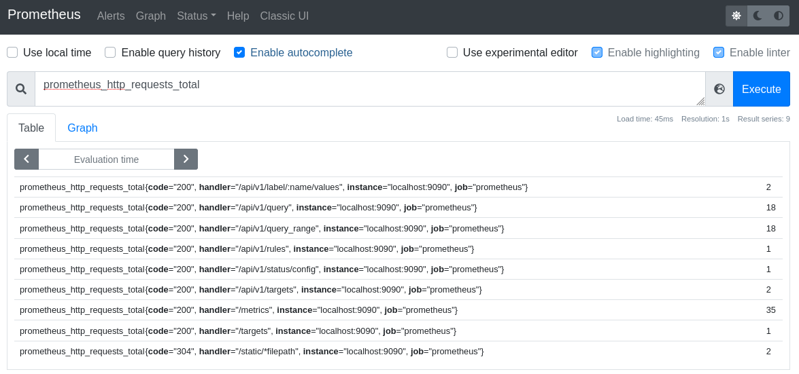
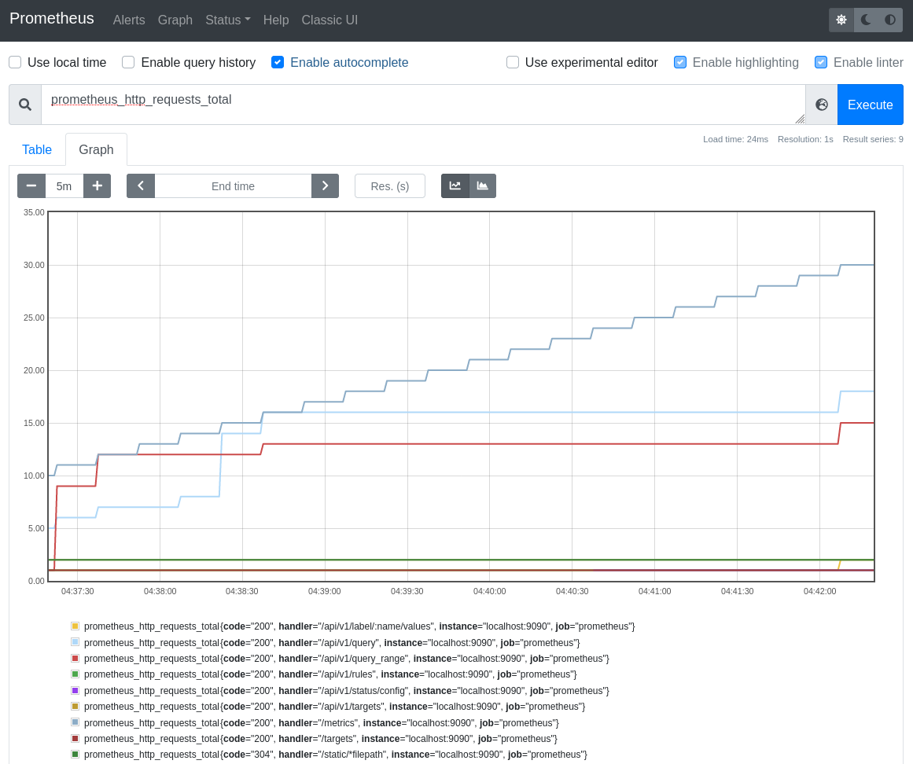
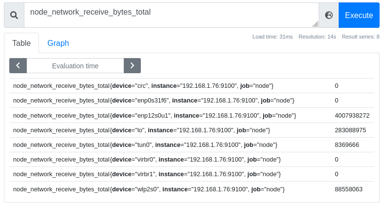
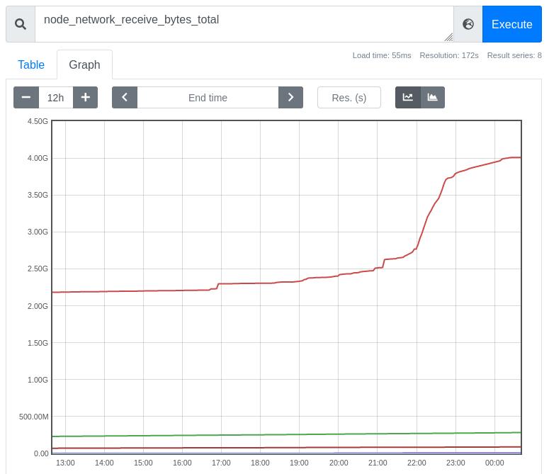
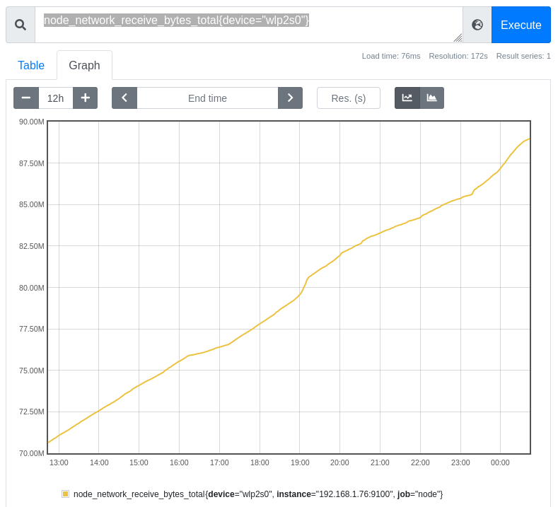
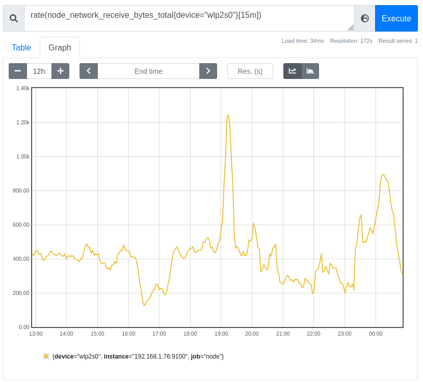
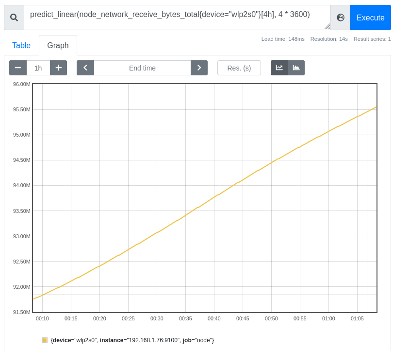

# Prometheus

[Prometheus](https://prometheus.io/) is an open-source monitoring and alerting system that provides insight into the state and history of a computer, application or cluster by storing defined metrics in a time-series database, and providing a powerful query language, PromQL, to help explore and understand the data.
Prometheus also includes an Alertmanager, making it easy to trigger notifications when certain threshold in the metrics we collect are crossed.
Most importantly, Prometheus is flexible, and easy to setup to monitor all kinds of metrics being provided by whatever system you need to track.

As SREs on Red Hat's OpenShift Dedicated team, we use Prometheus as a central component of our monitoring and alerting, for both clusters and other aspects of our infrastructure.
Using Prometheus we can predict when problems may occur by following trends in the data we collect from nodes in the cluster and services we run.
We can trigger alerts when certain thresholds are crossed or events occur.
As a data source for [Grafana](https://grafana.com/), we use Prometheus to produce graphs of data over time to see how a cluster or service is behaving.

Prometheus is a strategic piece of infrastructure for us at work, but it is also useful to me personally at home.
Luckily, not only is it powerful and useful, but it is easy to set up in a home environment, with or without Kubernetes,
OpenShift, containers, etc.
In this article, we will learn how to build a Prometheus container image and how to setup the Prometheus node exporter to being collecting data from our home computers.
We will also learn some basic PromQL, the query language Prometheus used to return data and create graphs.

## Build a Prometheus container image

The Prometheus project publishes its own container image, `quay.io/prometheus/prometheus`, but I enjoy building my own for home projects, and prefer to use the [Red Hat Universal Base Image](https://www.redhat.com/en/blog/introducing-red-hat-universal-base-image) family for my own projects.
These images are freely available for anyone to use.
My preference is the [Universal Base Image 8 minimal](https://catalog.redhat.com/software/containers/ubi8/ubi-minimal/5c359a62bed8bd75a2c3fba8)(ubi8-minimal), based on Red Hat Enterprise Linux 8.
The ubi8-minimal image is a smaller version of the normal ubi8 images.
It is larger than the ultra-sparse "busybox" image used by the official Prometheus container image, but since I use the Universal Base Image for other projects, that layer is a wash in terms of disk space for me.
(If two images use the same layer, that layer is shared between them, and doesn't use any additional disk space after the first image.)

My `Containerfile` for this project is split into a [multi-stage build](https://docs.docker.com/develop/develop-images/multistage-build/).
The first, builder, installs a few tools via DNF packages to make downloading and extracting a Prometheus release from Github easier, then downloads a specific release for whatever architecture I need (either arm64 for my RaspberryPi Kubernetes cluster, or amd64 for running locally on my laptop) and extracts it.

```txt
# The first stage build, downloading Prometheus from Github and extracting it

FROM registry.access.redhat.com/ubi8/ubi-minimal as builder
LABEL maintainer "Chris Collins <collins.christopher@gmail.com>"

# Install packages needed to download and extract the Prometheus release
RUN microdnf install -y gzip jq tar

# Replace the ARCH for different architecture versions, eg: "linux-arm64.tar.tz"
ENV PROMETHEUS_ARCH="linux-amd64.tar.gz"

# Replace "tag/<tag_name>" with "latest" to build whatever the latest tag is at the time
ENV PROMETHEUS_VERSION="tags/v2.27.0"
ENV PROMETHEUS="https://api.github.com/repos/prometheus/prometheus/releases/${PROMETHEUS_VERSION}"

# The checksum file for the Prometheus project is "sha256sums.txt"
ENV SUMFILE="sha256sums.txt"

RUN mkdir /prometheus
WORKDIR /prometheus

# Download the checksum
RUN /bin/sh -c "curl -sSLf $(curl -sSLf ${PROMETHEUS} -o - | jq -r '.assets[] | select(.name|test(env.SUMFILE)) | .browser_download_url') -o ${SUMFILE}"

# Download the binary tarball
RUN /bin/sh -c "curl -sSLf -O $(curl -sSLf ${PROMETHEUS} -o - | jq -r '.assets[] | select(.name|test(env.PROMETHEUS_ARCH)) |.browser_download_url')"

# Check the binary and checksum match
RUN sha256sum --check --ignore-missing ${SUMFILE}

# Extract the tarball
RUN tar --extract --gunzip --no-same-owner --strip-components=1 --directory /prometheus --file *.tar.gz
```

The second stage of the multi-stage build copies the extracted Prometheus files to a pristine ubi8-minimal image (no need for the extra tools from the first image to take up space in the final image), and links the binaries into the `$PATH`.

```txt
# The second build stage, creating the final image
FROM registry.access.redhat.com/ubi8/ubi-minimal
LABEL maintainer "Chris Collins <collins.christopher@gmail.com>"

# Get the binary from the builder image
COPY --from=builder /prometheus /prometheus

WORKDIR /prometheus

# Link the binary files into the $PATH
RUN ln prometheus /bin/
RUN ln promtool /bin/

# Validate prometheus binary
RUN prometheus --version

# Add dynamic target (file_sd_config) support to the prometheus config
# https://prometheus.io/docs/prometheus/latest/configuration/configuration/#file_sd_config
RUN echo -e "\n\
  - job_name: 'dynamic'\n\
    file_sd_configs:\n\
    - files:\n\
      - data/sd_config*.yaml\n\
      - data/sd_config*.json\n\
      refresh_interval: 30s\
" >> prometheus.yml

EXPOSE 9090
VOLUME ["/prometheus/data"]

ENTRYPOINT ["prometheus"]
CMD ["--config.file=prometheus.yml"]
```

The image can be built with the command:

```shell
# Build the Prometheus image from the Containerfile
podman build --format docker -f Containerfile -t prometheus
```

I'm using [Podman](https://docs.podman.io/en/latest/Introduction.html) as my container engine at home, but you can use Docker if you prefer. Just replace the `podman` command with `docker`, above.

After building this image, it is time to run Prometheus locally and start collecting some metrics.

## Running Prometheus

```shell
# This only needs to be done once
# This directory will store the metrics Prometheus collects so they persist between container restarts
mkdir data

# Run Prometheus locally, using the ./data directory for persistent data storage
# Note that the image name, prometheus:latest, will be whatever image you are using
podman run --mount=type=bind,src=$(pwd)/data,dst=/prometheus/data,relabel=shared --publish=127.0.0.1:9090:9090 --detach prometheus:latest
```

The Podman command above runs Prometheus in a container, mounting the "data" directory into the container, and allowing the Prometheus web interface to be accessed with a browser from the machine running the container, only.
If you would prefer to be able to access Prometheus from other hosts, replace the `--publish=127.0.0.1:9090:9090` in the command with `--publish=9090:9090`.

Once the container is running, you should be able to access Prometheus at the following: [http://127.0.0.1:9000/graph](http://127.0.0.1:9000/graph).
There is not much to look at yet, though.
By default, Prometheus only knows to check itself, the Prometheus service, for metrics related to itself.
For example, navigating to the link above, and entering a query for `prometheus_http_requests_total` will show how many http requests Prometheus itself has received (most likely, just those you have made so far).o



This query can be referenced as a URL as well: [http://127.0.0.1:9090/graph?g0.expr=prometheus_http_requests_total&g0.tab=1&g0.stacked=0&g0.range_input=1h](http://127.0.0.1:9090/graph?g0.expr=prometheus_http_requests_total&g0.tab=1&g0.stacked=0&g0.range_input=1h), and clicking it should take you to the same results.
By default, Prometheus scrapes for metrics every 15 seconds, so these metrics will update over time (assuming they have changed since the last scrape).

You can also graph the data over time by entering a query (as above) and clicking the "Graph" tab.



Graphs can also be referenced as a URL: [http://127.0.0.1:9090/graph?g0.expr=prometheus_http_requests_total&g0.tab=0&g0.stacked=0&g0.range_input=1h](http://127.0.0.1:9090/graph?g0.expr=prometheus_http_requests_total&g0.tab=0&g0.stacked=0&g0.range_input=1h)

This internal data is not helpful by itself, though.
Let's get some real useful metrics added.

## Add some data

Prometheus - the project - also publish a program called a "node-exporter" for exporting useful metrics about whatever computer, or node, the node exporter is running on.
We can use the node exporter to quickly create a metrics target for our local machine, exporting data such as memory utilization and CPU consumption for Prometheus to track.

In the interest of brevity, we can just run the `quay.io/prometheus/node-exporter:latest` container image published by the Projetheus project to get started.

Run the following with Podman or your container engine of choice:

```shell
podman run --net="host" --pid="host" --mount=type=bind,src=/,dst=/host,ro=true,bind-propagation=rslave --detach quay.io/prometheus/node-exporter:latest --path.rootfs=/host
```

This will start a node exporter on your local machine, and begin publishing metrics on port 9100.
You can see which metrics are being generated by opening the following in your browser: [http://127.0.0.1:9100/metrics](http://127.0.0.1:9100/metrics)
It will look similar to this:

```txt
# HELP go_gc_duration_seconds A summary of the pause duration of garbage collection cycles.
# TYPE go_gc_duration_seconds summary
go_gc_duration_seconds{quantile="0"} 0.000176569
go_gc_duration_seconds{quantile="0.25"} 0.000176569
go_gc_duration_seconds{quantile="0.5"} 0.000220407
go_gc_duration_seconds{quantile="0.75"} 0.000220407
go_gc_duration_seconds{quantile="1"} 0.000220407
go_gc_duration_seconds_sum 0.000396976
go_gc_duration_seconds_count 2
```

Now we just need to tell Prometheus that the data is there.
Prometheus uses a set of rules called "scrape_configs" defined in its configuration file, `prometheus.yml`, to decide what hosts to check for metrics, and how often to check them.
The scrape_configs can be set statically in the Prometheus config file, but that doesn't make Prometheus very flexible.
Each time you add a new target, you would have to update the config file, stop Prometheus manually, and restart it.
Prometheus has a better way, using "file-based service discovery".

In the Containerfile used above, you will see a stanza adding a dynamic file-based service discovery configuration to the Prometheus config file:

```txt
RUN echo -e "\n\
  - job_name: 'dynamic'\n\
    file_sd_configs:\n\
    - files:\n\
      - data/sd_config*.yaml\n\
      - data/sd_config*.json\n\
      refresh_interval: 30s\
" >> prometheus.ym
```

This tells Prometheus to look for files named "sd_config*.yaml" or "sd_config*.json" in the "data" directory that we mount into the running container, and to check every 30 seconds to see if there are more config files, or if they have changed at all.
Using files with that naming convention, we can tell Prometheus to start looking for other targets, such as the node exporter you started earlier.

Create a file named "sd_config_01.json" in the data directory with the following contents, replacing "your_hosts_ip_address" with the IP address of the host running the node exporter.

```txt
[{"labels": {"job": "node"}, "targets": ["your_hosts_ip_address:9100"]}
```

Check in prometheus: [http://127.0.0.1:9090/targets](http://127.0.0.1:9090/targets) - you should see prometheus monitoring itself (inside the container), as well as the target you added for the host with the node_exporter.
Clicking on the link for this new target will show the raw data Prometheus has scraped, and it should look familiar:

```txt
# NOTE: Truncated for brevity
# HELP go_gc_duration_seconds A summary of the pause duration of garbage collection cycles.
# TYPE go_gc_duration_seconds summary
go_gc_duration_seconds{quantile="0"} 3.6547e-05
go_gc_duration_seconds{quantile="0.25"} 0.000107517
go_gc_duration_seconds{quantile="0.5"} 0.00017582
go_gc_duration_seconds{quantile="0.75"} 0.000503352
go_gc_duration_seconds{quantile="1"} 0.008072206
go_gc_duration_seconds_sum 0.029700021
go_gc_duration_seconds_count 55
```

This is the same data being exported by the node exporter.

http://127.0.0.1:9090/graph?g0.expr=rate(node_network_receive_bytes_total%7B%7D%5B5m%5D)&g0.tab=0&g0.stacked=0&g0.range_input=15m

Now, with this information, we can start to create our own rules, and instrument our own applications to provide metrics for Prometheus to consume.

## A light introduction to PromQL

PromQL is Prometheus' query language - a powerful way to aggregate the time series data stored in Prometheus.
Prometheus shows you the output of a query either as the raw result, or it can be displayed as a graph showing the trend of the data over time, like the `node_network_receive_bytes_total` example above.
PromQL and be daunting to get into at first, and this article is not going to dive into a full tutorial on how to use it, but we will cover some basics.
To get started, pull up the query interface for Prometheus:

[http://127.0.0.1:9090/graph](http://127.0.0.1:9090/graph)

We will look at the `node_network_receive_bytes_total` metrics in this example.
Enter that string into the query field, and press enter to display all of the collected network metrics from the computer on which the node-exporter is running.
(Note that Prometheus provides an auto-complete feature, making it easy to explore the metrics collected.)
You may see several results, each with labels that have been applied to the data sent by the node-exporter:



Looking at the image above, you can see eight interfaces, each labeled by the device name (eg: `{device="ensp12s0u1"}`), the instance they were collected from (in this case, all the same node), and the job "node" that was assigned in the `sd_config_01.json`.
To the right of these is the latest raw metric data for this specific device.
In the case of the "ensp12s0u1" device, it's received `4007938272` bytes of data over the interface since Prometheus started tracking the data.

Note: The "job" label is useful in defining what kind of data is being collected. For example, "node" for metrics sent by the node-exporter, or "cluster" for Kubernetes cluster data, or perhaps an application name for a specific service you may be monitoring.

Now, clicking on the "Graph" tab, you can see the metrics for these devices graphed over time - one hour by default.
The time period can be adjusted using the `- +` toggle on the left.
Now historical data is displayed and graphed along with the current value.
This provides valuable insight into how the data changes over time:



The displayed data can be further refined using the labels.
At the moment, the graph is displaying all of the interfaces reported by the node-exporter, but what if we were interested just in the wireless device?
By changing the query to include the label, `node_network_receive_bytes_total{device="wlp2s0"}`, we can evaluate just the data matching that label.
Prometheus automatically adjusts the scale to a more human-readable one once the other devices' data is no longer included, too:



This data is helpful in itself, but Prometheus' PromQL also has a number of query functions that can be applied to the data in order to provide more information.
For example, we will look again at the `rate()` function.
The `rate()` function "calculates the per-second average rate of increase of the time series in the range vector".
That's a fancy way of saying: "show how quickly it the data grew".

Looking at the graph for the wireless device above, you can see a slight curve - slightly more vertical increase - in the line graphv right around 19:00 hours.
It doesn't look like much on it's own, but using the `rate()` function it is possible to calculate just how much larger a spike in growth there was around that timeframe.
Using the query `rate(node_network_receive_bytes_total{device="wlp2s0"}[15m])` will show the rate at which the received bytes increased for the wireless device, averaged per-second over a 15m period:



Now it is much more evident that around 19:00 hours the wireless device received almost three times as much traffic in for a breif period.

We can do much more with PromQL, too.
Using another function, `predict_linear()`, Prometheus can make an educated guess as to when a certain threshold will be crossed.
Using the same wireless network received bytes data, we can predict where the value will be over the next 4 hours, based on the data from the previous 4 hours (or any combination you might be interested in).
Try querying `predict_linear(node_network_receive_bytes_total{device="wlp2s0"}[4h], 4 * 3600)`.
The important bit of the `predict_linear()` function above is `[4h], 4 * 3600`.
The `[4h]` tells Prometheus to use the past four hours as a dataset, and then to predict where the value will be over the next 4 hours (or `4 * 3600` since there are 3600 seconds in an hour.)
Using the above example, Prometheus predicts (in my case, your data will vary), that the wireless device will have received almost 95.00M bytes of data about 1 hour from now:



You can start to see how this might be useful, especially in an operations capacity.
Kubernetes exports node disk usage metrics and includes a built in alert using `predict_linear()` to estimate when a disk might run out of space.
All of these queries can be used in conjunction with Prometheus' Alertmanager to notify when various conditions are met, from network utilization being too high, to disk space _probably_ running out in the next four hours, and more.
Alertmanager is another useful topic that we'll cover in a future article.

## Conclusion

Prometheus consumes metrics by scraping endpoints for specially formatted data. Data is tracked and can be queried for PIT info, or graphed to show changes over time.  Even better, Prometheus supports, out of the box, alerting rules that can hook in with your infrastructure in a variety of way.
Prometheus can also be used as a data source for other projects, like Grafana, to provide more sophisticated graphing information.

In the real world, at work, we use Prometheus to track metrics and provide alert thresholds that page us when clusters are unhealthy, and we use Grafana to make dashboards of data we need to view regularly.
We export node data to track our nodes, and instrument our operators to allow us to track their performance and health.
Prometheus is the backbone of all of it.

If you have been interested in Prometheus so far, keep your eyes peeled for follow-up articles.
We'll learn about alerting when certain conditions are met, using prometheus' built in Alertmanager and integrations with it, more complicated PromQL, and how to instrument your own application to be integrated with Prometheus
